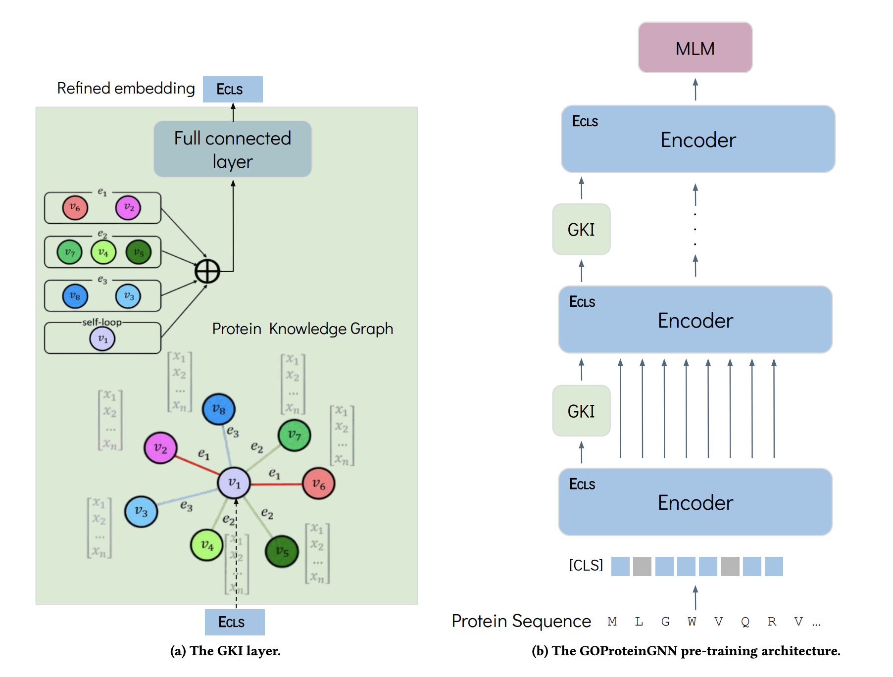

# GOProteinGNN: Leveraging Protein Knowledge Graphs for Protein Representation Learning

### Dan Kalifa, Uriel Singer and Kira Radinsky

#### In Proceedings of the The 38th Annual AAAI Conference on Artificial Intelligence, February 20-27, 2024, Vancouver, Canada.


> **Abstract:** Proteins play a vital role in biological processes and are indispensable for living organisms. Accurate representation of proteins is crucial, especially in drug development.
Recently, there has been a notable increase in interest in utilizing machine learning and deep learning techniques for unsupervised learning of protein representations. 
However, these approaches often focus solely on the amino acid sequence of proteins and lack factual knowledge about proteins and their interactions, thus limiting their performance.
In this study, we present GOProteinGNN, a novel algorithm that employs a graph neural network injection to perform a joint learning process of amino-level representations and protein-level representations. Our approach allows for the integration of information at both the individual amino acid level and the entire protein level, enabling a comprehensive and effective learning process through graph-based learning.
By doing so, we can capture complex relationships and dependencies between proteins and their functional annotations, resulting in more robust and contextually enriched protein representations.
We perform comprehensive evaluations on several downstream tasks demonstrating that GOProteinGNN consistently outperforms previous methods, showcasing its effectiveness and establishing it as a state-of-the-art solution for protein representation learning.

The GOProteinGNN pre-training architecture:


This repository provides a reference implementation of GOProteinGNN and baselines as described in the paper.
Some code was borrowed from [KeAP](https://github.com/RL4M/KeAP) and [OntoProtein](https://github.com/zjunlp/OntoProtein).

----
## ProteinKG25 Configuration
[ProteinKG25]((https://zjunlp.github.io/project/ProteinKG25/)) is a large-scale knowledge graph dataset with aligned descriptions and protein sequences respectively to GO terms and protein entities. This dataset is necessary for performing pre-training. You can follow the [instruction](./datasets/ProteinKG25.md) to configure ProteinKG25.

----  
## Environments for Pre-training
**Main dependencies** is listed in the `requirments.txt` file and build with Python 3.7. Execute the following command to install all required dependencies:
```shell
pip install -r requirements.txt
```

Following [OntoProtein](https://github.com/zjunlp/OntoProtein), we also make small changes to the `deepspeed.py` file under transformers library (❗required for pre-training).
The changes can be applied by running:
```shell
cp replace_code/deepspeed.py <path-to-python3.7>/site-packages/transformers/deepspeed.py
```

----
## Environments for Downstream Tasks
**Main dependencies** is listed in the `requirments.txt` file and build with Python 3.7. Execute the following command to install all required dependencies:
```shell
pip install -r requirements.txt
```
Note PyTorch Geometric is required for the PPI (protein-protein interaction) task. Check your PyTorch and cuda versions, and follow the [installation instructions](https://pytorch-geometric.readthedocs.io/en/latest/install/installation.html) to install correctly.

Since the `tape_proteins` library only implemented the `P@L` metric for the contact prediction task, we add the `P@L/5` and `P@L/2` metrics by running the following script:
```shell
cp replace_code/tape/modeling_utils.py <path-to-python3.7>/site-packages/tape/models/modeling_utils.py
```


----
## Data Preparation
For pre-training data preparation, please refer to [here](./datasets/ProteinKG25.md).

The data for [TAPE](https://github.com/songlab-cal/tape) tasks and the PPI task can be downloaded from [here](https://drive.google.com/file/d/1EH7NJ421fXazZhDh0frdfYW4aXlOZSsO/view?usp=sharing).
The data for the [PROBE](https://github.com/kansil/PROBE) tasks can be acquired via [link](https://drive.google.com/file/d/10Wgy6X-BtB6gtHBDPfTSFsJSVbKQ_jlW/view?usp=sharing).

----
## Models Preparation
After configuring ProteinKG25, you also need to download the following two pre-trained models: 
- [ProtBERT](https://huggingface.co/Rostlab/prot_bert) for initializing the protein encoder. 
- [PubMedBERT](https://huggingface.co/microsoft/BiomedNLP-PubMedBERT-base-uncased-abstract-fulltext) for extracting text features in Gene Onotology Annotations. 

Then, configure paths in `script/run_pretrain.sh` (`PRETRAIN_DATA_DIR`, `ENCODER_MODEL_PATH`, `TEXT_MODEL_PATH`) accordingly.

Run the following script for pre-training:
```shell
sh ./script/run_pretrain.sh
```
The detailed arguments are listed in `src/training_args.py`. 

----
## Downstream Tasks (Fine-tuning)

In this part, we fine-tune the [pre-trained model](https://drive.google.com/file/d/1OMvpRKc9ZgOY98Zsh3OQpOOWAdB_s_9m/view?usp=sharing) (GOProteinGNN) on various downstream tasks.

❗NOTE: You will need to change some paths for downstream data and extracted embeddings (PPI and PROBE tasks) before running the code.

### TAPE Tasks
Secondary structure prediction, contact prediction, remote homology detection, stability prediction, and fluorescence prediction are tasks from [TAPE](https://github.com/songlab-cal/tape).

Similar to [KeAP](https://github.com/RL4M/KeAP) and [OntoProtein](https://github.com/zjunlp/OntoProtein), for these tasks, we provide scripts for fine-tuning under `script/` (❗Preferred). You may need to modify the DATA_DIR and OUTPUT_DIR paths in `run_main.sh` before running the scripts.

For example, you can fine-tune GOProteinGNN for contact prediction by running the following script:
```shell
sh ./script/run_contact.sh
```

You can also use the running codes in `run_downstream.py` to write shell files with custom configurations.
- `run_downstream.py`: support `{ss3, ss8, contact, remote_homology, fluorescence, stability}` tasks;
- `run_stability.py`: support `stability` task;

An example of fine-tuning GOProteinGNN for contact prediction (`script/run_contact.sh`) is as follows:

```shell
bash run_main.sh \
      --model gcn-output/pretrained/GOProteinGCN/encoder \
      --tokenizer "Rostlab/prot_bert" \
      --output_file contact-GOProteinGCN \
      --task_name contact \
      --do_train True \
      --epoch 5 \
      --optimizer AdamW \
      --per_device_batch_size 2 \
      --gradient_accumulation_steps 8 \
      --eval_step 50 \
      --eval_batchsize 1 \
      --warmup_ratio 0.08 \
      --learning_rate 3e-5 \
      --seed 3 \
      --frozen_bert False
```

Arguments for the training and evaluation script are as follows,

- `--task_name`: Specify downstream task. The script supports `{ss3, ss8, contact, remote_homology, fluorescence, stability}` tasks;
- `--model`: The name or path of a pre-trained protein language model checkpoint.
- `--tokenizer`: The name or path of a tokenizer.
- `--output_file`: The path to save fine-tuned checkpoints and logs.
- `--do_train`: Specify if you want to fine-tune the pretrained model on downstream tasks. Set this to `False` if you want to evaluate a fine-tuned checkpoint on the test set.
- `--epoch`: Number of epochs for training.
- `--optimizer`: The optimizer to use, e.g., `AdamW`.
- `--per_device_batch_size`: Batch size per GPU.
- `--gradient_accumulation_steps`: The number of gradient accumulation steps.
- `--eval_step`: Number of steps to run evaluation on validation set.
- `--eval_batchsize`: Evaluation batch size.
- `--warmup_ratio`: Ratio of total training steps used for a linear warmup from 0 to `learning_rate`.
- `--learning_rate`: Learning rate for fine-tuning
- `--seed`: Set seed for reproducibility
- `--frozen_bert`: Specify if you want to freeze the encoder in the pretrained model.

More detailed parameters can be found in `run_main.sh`. Note that the best checkpoint is saved in `OUTPUT_DIR/`.

### PROBE Tasks
Semantic similarity inference and binding affinity estimation are tasks from [PROBE](https://github.com/kansil/PROBE).
The code for PROBE can be found in `src/benchmark/PROBE`.

To validate GOProteinGNN on these two tasks, you need to:
- Configure paths in `src/benchmark/PROBE/extract_embeddings.py` to your pre-trained model and PROBE data accordingly.
- Extract embeddings using pre-trained GOProteinGNN by running `src/benchmark/PROBE/extract_embeddings.py`. 
- Change paths listed in `src/benchmark/PROBE/bin/probe_config.yaml` accordingly. 
- Run `src/benchmark/PROBE/bin/PROBE.py`. 

Detailed instructions and explanations of outputs can be found in [PROBE](https://github.com/kansil/PROBE).

### PPI Task
The code for PPI can be found in `src/benchmark/GNN_PPI`, which was modified based on [GNN-PPI](https://github.com/lvguofeng/GNN_PPI).

To validate GOProteinGNN for PPI prediction:
- Configure paths in `src/benchmark/GNN_PPI/extract_protein_embeddings.py` to your pre-trained model and PPI data accordingly.
- Extract embeddings using pre-trained GOProteinGNN by running `src/benchmark/GNN_PPI/extract_protein_embeddings.py`.
- Change paths listed in `src/benchmark/GNN_PPI/run.py` accordingly. 
- Run `src/benchmark/GNN_PPI/run.py` (training stage).
- Run `src/benchmark/GNN_PPI/run_test.py` (test stage).

----